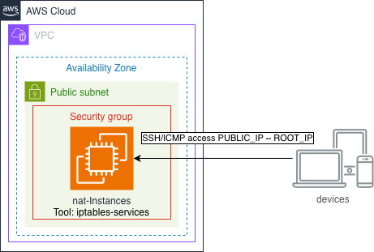

# AWS NAT Instance Module

Este módulo de Terraform despliega una **NAT Instance** en una VPC de AWS, configurada para enrutar tráfico de salida desde **subnets privadas** hacia Internet. Incluye:

- EC2 NAT Instance con Amazon Linux 2
- Configuración de iptables para NAT
- EIP asociada
- Security Groups para la NAT y las instancias privadas
- Ruta en la tabla de rutas privada existente

---

## Requisitos

- Terraform >= 1.5
- AWS Provider >= 5.x
- Una VPC existente con:
  - Subnet pública para la NAT
  - CIDR de las subnets privadas
  - Tabla de rutas privadas (`route_table_id`) ya creada

---

## Pruebas / Validación

1.- Conéctate a la NAT Instance usando SSH:

```bash
ssh -i <key.pem> ec2-user@<NAT_EIP>
```

2.- Verifica IP forwarding:

```bash
sudo sysctl net.ipv4.ip_forward
```

3.- Verifica reglas NAT:

```bash
sudo iptables -t nat -L -n -v
```

4.- Prueba conectividad a Internet desde la NAT:

```bash
curl -s https://ifconfig.me
ping -c 3 8.8.8.8
```

5.- Lanza una instancia privada en la subnet privada y prueba acceso a Internet:

```bash
ssh ec2-user@<PRIVATE_IP>  # desde la NAT
curl -s https://ifconfig.me  # Debe mostrar la misma EIP de la NAT
```

## Notas

La NAT Instance debe tener **source_dest_check** = false.
La EIP se recomienda asociar a la interfaz de red para evitar recreación.
Las subnets privadas deben usar la ruta **0.0.0.0/0** hacia la NAT.
Este módulo no crea el Internet Gateway ni las tablas de rutas públicas.

## Referencias

- [Terraform aws_instance](https://registry.terraform.io/providers/hashicorp/aws/latest/docs/resources/instance)
- [Terraform aws_route](https://registry.terraform.io/providers/hashicorp/aws/latest/docs/resources/route)
- [AWS NAT Instance](https://docs.aws.amazon.com/vpc/latest/userguide/VPC_NAT_Instance.html)

## Diagrama de la arquitectura


